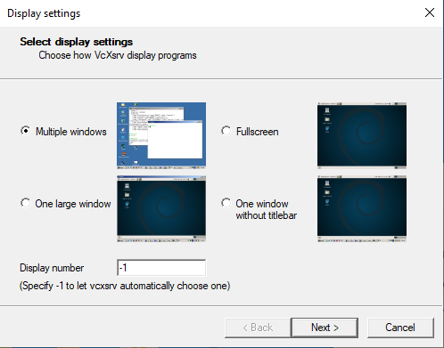
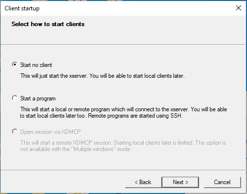
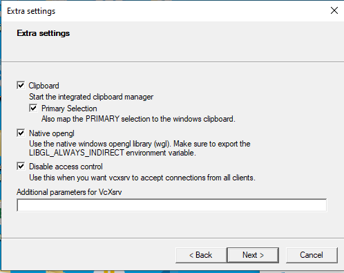
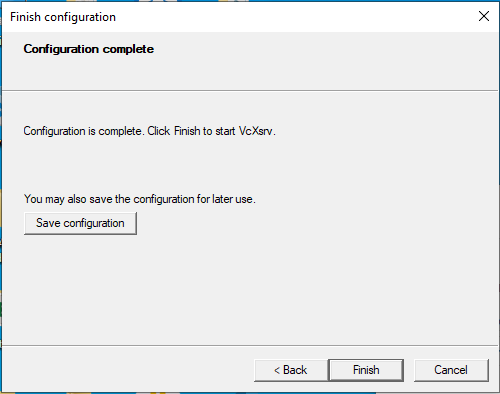

# Troubleshoot

## Open display error on WSL Windows 10
```
[Err] [RenderEngine.cc:749] Can't open display:
[Wrn] [RenderEngine.cc:89] Unable to create X window. Rendering will be disabled
[Wrn] [RenderEngine.cc:292] Cannot initialize render engine since render path type is NONE. Ignore this warning ifrendering has been turned off on purpose.
```

**Fix**

- Download and install [VcXsrv windows X server](https://sourceforge.net/projects/vcxsrv/)
- Launch VcXsrv windows X server
  
  

- Configure display settings

<figure>
    
    <figcaption>Select Multiple windows</figcaption>
</figure>

<figure>
    
    <figcaption>Select Start no client</figcaption>
</figure>

<figure>
    
    <figcaption>Disable access control</figcaption>
</figure>

<figure>
    
    <figcaption>Finish</figcaption>
</figure>

- Export `$DISPLAY` variable on WSL

    ```bash
    echo "export DISPLAY=\$(cat /etc/resolv.conf | grep nameserver | awk '{print \$2}'):0" >> ~/.bashrc
    ```